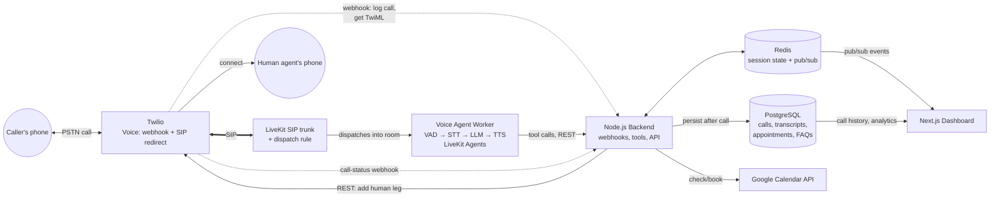

# Architecture

Read [01-CONCEPTS.md](01-CONCEPTS.md) first if terms like VAD, LiveKit, or
event-driven architecture are unfamiliar — this doc assumes that vocabulary.

## 1. System diagram

No audio ever flows through our own backend — Twilio hands the call to LiveKit
directly over SIP, and LiveKit dispatches the agent worker into the resulting
room. The backend's job is bookending the call (log it, later close it out) and
being the thing the agent calls out to for tools, not moving audio. See
`apps/backend/src/routes/twilio.ts` and `infra/livekit-sip/README.md` for why.

## 2. Components and their jobs

**Twilio** — the only component that touches the real telephone network. Owns the
phone number, answers incoming calls (hitting our webhook), then redirects the
call over SIP directly into LiveKit — Twilio never talks to our backend again for
that call's audio. Also executes call control instructions (adding a human leg
for transfer) issued by the backend via the Twilio REST API.

**Node.js backend** — the orchestrator, but deliberately *not* in the audio path.
Responsibilities:
- `POST /twilio/incoming-call` — validates Twilio's signature, creates the
  `calls` row, and returns TwiML that redirects the call over SIP into LiveKit
  (credentials/host from the trunk set up in `infra/livekit-sip/`).
- `POST /twilio/call-status` — Twilio calls this when the SIP leg ends; closes
  out the `calls` row (`endedAt`, `durationSec`).
- Exposes the tools the LLM can call: `check_availability`, `book_appointment`,
  `lookup_faq`, `transfer_to_human`.
- Writes session state to Redis during the call, and final records to Postgres
  after.
- Publishes events to Redis pub/sub for the dashboard to consume live.
- REST/WebSocket API for the Next.js dashboard (call list, live transcript feed,
  analytics queries).

**Voice agent pipeline (LiveKit Agents, `agent/`)** — a separate worker process
that LiveKit automatically dispatches into a room the instant a SIP call arrives
(per the dispatch rule in `infra/livekit-sip/`) — nothing in our own code
triggers this. Once dispatched, it runs VAD → STT → LLM → TTS for that call,
handling turn-taking and barge-in. It's intentionally provider-agnostic: STT/
LLM/TTS are configured, not hardcoded, so you can point it at free-tier
providers now and swap to paid ones later without changing the surrounding
system. See [03-FREE-TIER-STACK.md](03-FREE-TIER-STACK.md) for which providers.

**Redis** — two jobs, kept logically separate even though it's one instance
in dev:
1. *Session state* — per-call conversation history and booking-flow state, keyed
   by call SID, with a TTL so abandoned calls don't leak memory.
2. *Pub/sub* — event bus (`call.started`, `transcript.partial`, `transcript.final`,
   `appointment.booked`, `call.transferred`, `call.ended`) that the dashboard's
   WebSocket layer subscribes to for live updates.

**PostgreSQL** — system of record. Schema in §4.

**Google Calendar API** — availability checks and event creation, called from the
backend's tool-handling code (never directly from the LLM or the agent process).

**Next.js dashboard** — three real views: live call monitor (transcript + audio
level as it happens, with a "take over" button that triggers human handoff),
